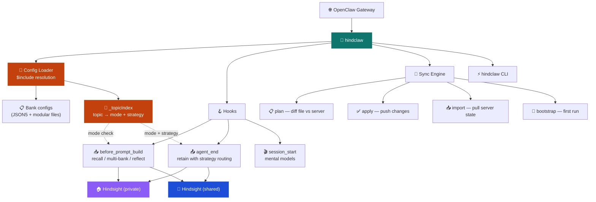
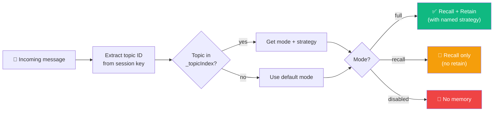
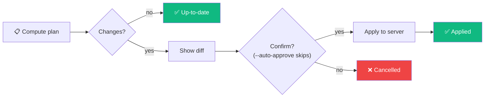

<p align="center">
  
</p>

# HindClaw

> 🔌 Production-grade [Hindsight](https://vectorize.io/hindsight) memory plugin for [OpenClaw](https://openclaw.ai)
>
> Repository: `hindclaw`

[](https://www.npmjs.com/package/hindclaw)


> **Based on [`@vectorize-io/hindsight-openclaw`](https://github.com/vectorize-io/hindsight/tree/main/hindsight-integrations/openclaw)** (MIT, Copyright (c) 2025 Vectorize AI, Inc.)
>
> This project is a production-grade rewrite of the original Hindsight OpenClaw plugin by [Vectorize](https://vectorize.io). The upstream plugin provides the foundation — two-hook architecture (`before_prompt_build` for recall, `agent_end` for retain), bank ID derivation, daemon lifecycle management, and memory formatting. We extend it with per-agent bank configuration, multi-bank recall, session start context, reflect-on-recall, IaC bank management via CLI, and full Hindsight API coverage.

Per-agent bank configuration via IaC template files, multi-bank recall, session start context injection, reflect-on-recall, and a Terraform-style CLI (`hindclaw`) for managing bank configurations.

| | Feature | Description |
|---|---------|-------------|
| 📋 | Per-agent config | Each agent gets a bank config template file — missions, entity labels, directives, dispositions |
| 🏗️ | Infrastructure as Code | `hindclaw plan` / `apply` / `import` — Terraform-style bank management |
| 🎯 | Strategy-scoped memory | Named retain strategies routed per Telegram topic — different extraction rules per context |
| 📂 | `$include` directives | Split large bank configs into modular files — entity labels, strategy definitions |
| 🔀 | Multi-bank recall | `recallFrom` lets an agent query multiple banks per turn (Yoda pattern) |
| 🧩 | Session start context | Mental models loaded at session start — no cold start problem |
| 🪞 | Reflect on recall | Disposition-aware reasoning via Hindsight reflect API |
| 🚀 | Bootstrap | First-run auto-apply of bank config to empty banks |
| 🏢 | Multi-server | Per-agent infrastructure overrides — private + shared Hindsight servers |
| 🔐 | User-scoped access | Confluence-style permissions — users, groups, bank-level overrides |
| 🛠️ | `hindclaw init` | Bootstrap `.openclaw/hindsight/` directory with migration from v1.x |

> [!IMPORTANT]
> This plugin replaces `@vectorize-io/hindsight-openclaw`.
> It is the **single memory provider** for the gateway — all agents must have a bank config.

---

## 🗺️ Architecture



---

## 🎯 Strategy-Scoped Memory

Route memory behavior per conversation context. Each Telegram topic (or future: channel) can use a different retain strategy with its own extraction rules, or disable memory entirely.

### 🔀 Memory Modes



### ⚙️ Configuration

```json5
{
  // Named strategies — server-side extraction overrides (synced via hindclaw)
  "retain_strategies": {
    "deep-analysis": { "$include": "./agent/deep-analysis.json5" },
    "lightweight":   { "$include": "./agent/lightweight.json5" }
  },

  // Memory routing — plugin-side, maps strategies → scopes
  "memory": {
    "default": "full",          // unmapped conversations: full memory (bank defaults)
    "full": {
      "deep-analysis": {
        "topics": ["12345"]     // strategic conversations → verbose extraction
      },
      "lightweight": {
        "topics": ["67890"]     // daily updates → concise extraction
      }
    },
    "recall": {
      "readonly-strat": {
        "topics": ["11111"]     // read-only — recalls memory, never writes
      }
    },
    "disabled": {
      "silent": {
        "topics": ["99999"]     // no memory interaction at all
      }
    }
  }
}
```

### 🔧 How It Works

| Layer | What | Where |
|-------|------|-------|
| **Strategy definitions** | Extraction rules (mission, mode, entity labels) | `retain_strategies` → synced to Hindsight API via `hindclaw apply` |
| **Memory routing** | Which strategy applies where + mode control | `memory` section → resolved at gateway startup, stays in plugin |
| **`$include`** | Modular file references | Resolved at config load time, before anything else |

### 📂 `$include` Directives

Split large configs into manageable files. Resolved recursively, relative to the containing file:

```json5
// Main bank config
{
  "entity_labels": { "$include": "./agent/labels.json5" },
  "retain_strategies": {
    "detailed": { "$include": "./agent/detailed-strategy.json5" }
  }
}
```

```
.openclaw/banks/
├── agent.json5                    ← main bank config
├── agent/
│   ├── labels.json5               ← entity label definitions
│   ├── detailed-strategy.json5    ← strategy: verbose + custom labels
│   └── quick-strategy.json5       ← strategy: concise extraction
```

Limits: max depth 10, circular reference detection, paths relative to containing file.

### 💡 Example Scenarios

**A founder's strategic advisor** — one agent, three conversation contexts:

| Topic | Mode | Strategy | What happens |
|-------|------|----------|--------------|
| "Strategy" | `full` | `deep-analysis` | Every decision, risk, and opportunity is extracted with verbose detail and classified by department + decision type |
| "Daily updates" | `full` | `lightweight` | Only hard facts kept — "invoice paid", "meeting moved to Thursday". No analysis overhead |
| "Weekly review" | `recall` | — | Agent reads all memories to give a summary, but the review conversation itself isn't stored — avoids duplicate noise |
| *(any other topic)* | `full` | *(bank defaults)* | Standard extraction with the agent's default mission |

**A health agent with sensitive boundaries:**

| Topic | Mode | Strategy | What happens |
|-------|------|----------|--------------|
| "Fitness log" | `full` | `training` | Extracts sets, reps, PRs, recovery scores — structured for trend analysis |
| "Medical" | `recall` | — | Agent can reference past health data to answer questions, but medical conversations are never retained |
| "Sleep" | `full` | `wellness` | Tracks sleep patterns, WHOOP scores, energy observations |
| *(any other topic)* | `disabled` | — | Health agent has no memory outside designated topics — strict data boundaries |

**A team assistant with access control:**

| Topic | Mode | Strategy | What happens |
|-------|------|----------|--------------|
| "Engineering" | `full` | `technical` | Retains architecture decisions, bug reports, deployment notes |
| "HR" | `recall` | — | Can look up policy docs and past decisions, but sensitive HR conversations stay ephemeral |
| "Random" | `disabled` | — | Water cooler chat — no memory at all |

---

## ⚡ Quick Start

### 1️⃣ Install Hindsight

The plugin needs a Hindsight server. Two options:

**Option A: Local daemon (recommended for single-server setups)**

The plugin starts and manages the daemon automatically — no separate install needed. It uses [`hindsight-embed`](https://pypi.org/project/hindsight-embed/) under the hood.

Requirements: Python 3.11+ and `uv` (or `pip`).

```bash
# Optional: pre-install hindsight-embed to verify it works
uv tool install hindsight-embed
hindsight-embed daemon start          # starts on port 9077
hindsight-embed daemon status         # verify it's running
```

**Option B: Remote / shared server**

If Hindsight runs on a separate machine (e.g., office server shared by a team), point the plugin to it:

```json5
{
  "hindsightApiUrl": "https://hindsight.office.local",
  "hindsightApiToken": "your-api-token"
}
```

### 2️⃣ Install the plugin

```bash
openclaw plugins install hindclaw
```

> [!NOTE]
> The installer registers the plugin and assigns it to the `memory` slot automatically.
> If a previous memory plugin was installed, it will be replaced.

### 3️⃣ Configure plugin

Add to your `openclaw.json` (or a `$include`'d config file):

```json5
{
  "plugins": {
    "entries": {
      "hindclaw": {
        "enabled": true,
        "config": {
          // Local daemon mode — no hindsightApiUrl needed
          // Remote mode — uncomment:
          // "hindsightApiUrl": "https://hindsight.office.local",
          // "hindsightApiToken": "...",

          "dynamicBankGranularity": ["agent"],
          "bootstrap": true,

          "agents": {
            "atlas":   { "bankConfig": "./banks/atlas.json5" },
            "finance": { "bankConfig": "./banks/finance.json5" },
            "health":  { "bankConfig": "./banks/health.json5" }
          }
        }
      }
    }
  }
}
```

### 4️⃣ Create bank configs

Create a config file per agent. Example `.openclaw/banks/atlas.json5`:

```json5
{
  // Server-side — synced to Hindsight via hindclaw
  "retain_mission": "Extract strategic decisions, priorities, risks, opportunities.",
  "reflect_mission": "You are the strategic advisor. Challenge assumptions.",
  "disposition_skepticism": 4,
  "disposition_literalism": 2,
  "disposition_empathy": 3,
  "entity_labels": [
    { "name": "department", "description": "Which department this relates to", "values": ["engineering", "finance", "marketing"] }
  ],
  "directives": [
    { "name": "cross_dept_honesty", "content": "Flag contradictions between departments explicitly." }
  ],

  // Named strategies (optional) — different extraction rules per context
  "retain_strategies": {
    "deep-analysis": {
      "retain_extraction_mode": "verbose",
      "retain_mission": "Extract every decision, risk, and opportunity in full detail."
    },
    "lightweight": {
      "retain_extraction_mode": "concise",
      "retain_mission": "Only keep hard facts — dates, numbers, action items."
    }
  },

  // Memory routing (optional) — map strategies to conversation topics
  "memory": {
    "default": "full",
    "full": {
      "deep-analysis": { "topics": ["12345"] },
      "lightweight":   { "topics": ["67890"] }
    },
    "recall": {},
    "disabled": {}
  },

  // Multi-bank recall (optional) — read from multiple agents' memories
  "recallFrom": ["atlas", "finance", "health"],
  "recallBudget": "high",
  "recallMaxTokens": 2048
}
```

### 5️⃣ Apply configs & start

```bash
# Preview what will be synced to Hindsight
hindclaw plan --all

# Apply (shows plan, asks for confirmation)
hindclaw apply --all

# Start the gateway
openclaw gateway
```

> [!TIP]
> On first startup with `bootstrap: true`, the plugin auto-applies bank configs to empty banks.
> After that, use `hindclaw plan/apply` to manage changes.

### 6️⃣ Hindsight UI (optional)

View memory banks, strategies, and stored memories in the browser:

```bash
# Start the control plane UI (default: http://localhost:9999)
hindsight-embed -p <profile-name> ui

# Or as a systemd service (recommended for servers):
# ExecStart=hindsight-embed -p <profile-name> ui
```

Open `http://localhost:9999` — select a bank from the dropdown to explore memories, configuration, and strategies.

---

## 🏛️ Configuration

### 📦 Two-Level Config System

```text
openclaw.json (plugin config)          banks/r4p17.json5 (bank config template)
├── Daemon (global only)               ├── Server-side (agent-only)
│   apiPort, embedPort, embedVersion   │   retain_mission, reflect_mission
│   embedPackagePath, daemonIdleTimeout│   dispositions, entity_labels, directives
│                                      │
├── Defaults (overridable per-agent)   ├── Infrastructure overrides (optional)
│   hindsightApiUrl, hindsightApiToken │   hindsightApiUrl, hindsightApiToken
│   dynamicBankGranularity, bankIdPfx  │   dynamicBankGranularity, bankIdPrefix
│   llmProvider, llmModel              │
│   autoRecall, autoRetain, ...        ├── Behavioral overrides (optional)
│                                      │   recallBudget, retainTags, llmModel, ...
├── Bootstrap: true|false              │
│                                      ├── Multi-bank: recallFrom [...]
└── Agent mapping                      ├── Session start: sessionStartModels [...]
    agents: { id: { bankConfig } }     └── Reflect: reflectOnRecall, reflectBudget
```

Resolution: `pluginDefaults → bankFile` — shallow merge, bank file wins.

### 🔌 Plugin Config Reference

| Option | Default | Per-agent | Description |
|--------|---------|-----------|-------------|
| `hindsightApiUrl` | — | ✅ | Hindsight API URL |
| `hindsightApiToken` | — | ✅ | Bearer token for API auth |
| `apiPort` | `9077` | ❌ | Port for local daemon (embed mode only) |
| `embedVersion` | `"latest"` | ❌ | `hindsight-embed` version |
| `embedPackagePath` | — | ❌ | Local `hindsight-embed` path (development) |
| `daemonIdleTimeout` | `0` | ❌ | Daemon idle timeout (0 = never) |
| `dynamicBankId` | `true` | ✅ | Derive bank ID from context |
| `dynamicBankGranularity` | `["agent","channel","user"]` | ✅ | Fields for bank ID derivation |
| `bankIdPrefix` | — | ✅ | Prefix for derived bank IDs |
| `autoRecall` | `true` | ✅ | Inject memories before each turn |
| `autoRetain` | `true` | ✅ | Retain conversations after each turn |
| `recallBudget` | `"mid"` | ✅ | Recall effort: `low`, `mid`, `high` |
| `recallMaxTokens` | `1024` | ✅ | Max tokens injected per turn |
| `recallTypes` | `["world","experience"]` | ✅ | Memory types to recall |
| `retainRoles` | `["user","assistant"]` | ✅ | Roles captured for retention |
| `retainEveryNTurns` | `1` | ✅ | Retain every Nth turn |
| `llmProvider` | auto | ✅ | LLM provider for extraction |
| `llmModel` | provider default | ✅ | Model name |
| `bootstrap` | `false` | ❌ | Auto-apply bank configs on first run |
| `agents` | `{}` | ❌ | Per-agent bank config registration |

### 📋 Bank Config File Reference

| Field | Type | Scope | Description |
|-------|------|-------|-------------|
| `retain_mission` | string | 🔧 Server | Guides fact extraction during retain |
| `observations_mission` | string | 🔧 Server | Controls observation consolidation |
| `reflect_mission` | string | 🔧 Server | Prompt for reflect operations |
| `retain_extraction_mode` | string | 🔧 Server | Extraction strategy (`concise`, `verbose`) |
| `disposition_skepticism` | 1–5 | 🔧 Server | How skeptical during extraction |
| `disposition_literalism` | 1–5 | 🔧 Server | How literally statements are interpreted |
| `disposition_empathy` | 1–5 | 🔧 Server | Weight given to emotional content |
| `entity_labels` | EntityLabel[] | 🔧 Server | Custom entity types for classification |
| `directives` | `{name,content}[]` | 🔧 Server | Standing instructions for the bank |
| `retain_strategies` | Record | 🔧 Server | Named extraction strategies (synced via `hindclaw`) |
| `retain_default_strategy` | string | 🔧 Server | Fallback strategy when no named strategy is passed |
| `retain_chunk_size` | number | 🔧 Server | Text chunk size for processing |
| `memory` | MemoryRouting | 🎯 Routing | Topic-based mode + strategy routing (plugin-side) |
| `retainTags` | string[] | 🏷️ Tags | Tags added to all retained facts |
| `retainContext` | string | 🏷️ Tags | Source label for retained facts |
| `retainObservationScopes` | string \| string[][] | 🏷️ Tags | Observation consolidation scoping |
| `recallTags` | string[] | 🏷️ Tags | Filter recall results by tags |
| `recallTagsMatch` | `any\|all\|any_strict\|all_strict` | 🏷️ Tags | Tag filter mode |
| `recallFrom` | string[] | 🔀 Multi-bank | Banks to query (parallel recall) |
| `sessionStartModels` | SessionStartModelConfig[] | 🧩 Session | Mental models loaded at session start |
| `reflectOnRecall` | boolean | 🪞 Reflect | Use reflect instead of recall |
| `reflectBudget` | `low\|mid\|high` | 🪞 Reflect | Reflect effort level |
| `reflectMaxTokens` | number | 🪞 Reflect | Max tokens for reflect response |

All plugin-level behavioral options can also be overridden per-agent in the bank config file.

---

## 🌐 Multi-Server Support

Per-agent infrastructure overrides enable connecting different agents to different Hindsight servers:

```text
Gateway
├── 🏠 r4p17 (private)  → hindsightApiUrl: "https://hindsight.home.local"
├── 🏠 l337  (health)   → hindsightApiUrl: "https://hindsight.home.local"
├── 🏢 bb8   (company)  → hindsightApiUrl: "https://hindsight.office.local"
├── 🏢 bb9e  (company)  → hindsightApiUrl: "https://hindsight.office.local"
└── 🔧 cb23  (local)    → no hindsightApiUrl (local daemon)
```

---

## ⚡ CLI: hindclaw

Terraform-style management of Hindsight bank configurations. Local bank config files are the source of truth — `hindclaw` diffs them against the server and applies changes.

```bash
# 📋 Preview changes (read-only, never modifies server)
hindclaw plan --all
hindclaw plan --agent r4p17

# ✅ Apply changes (shows plan first, asks for confirmation)
hindclaw apply --all
hindclaw apply --agent r4p17
hindclaw apply --agent r4p17 --auto-approve   # skip confirmation (CI)

# 📥 Import server state to local file
hindclaw import --agent r4p17 --output ./banks/r4p17.json5

# 🛠️ Bootstrap v2.0.0 directory structure
hindclaw init --from-existing           # migrate current config + banks
hindclaw init --from-existing --force   # overwrite existing
hindclaw init                           # fresh setup (empty templates)
```

### 📋 Plan Output

```
# bank.r4p17 (r4p17)

  + retain_strategies
      + {
      +   "detailed": {
      +     "retain_extraction_mode": "verbose",
      +     "retain_mission": "Extract financial metrics, margins, cashflow..."
      +   },
      +   "quick": {
      +     "retain_extraction_mode": "concise"
      +   }
      + }

  ~ retain_mission
    "Extract financial data..." → "Extract financial metrics, P&L, cashflow..."

  - old_directive
    "Deprecated instruction that will be removed"

Plan: 2 to add, 1 to change, 1 to destroy.
```

### ✅ Apply Flow



| Command | Description |
|---------|-------------|
| `plan` | Diff local bank config files against Hindsight server state |
| `apply` | Show plan, ask confirmation, apply changes (config + directives) |
| `import` | Pull current server state into a local file |
| `init` | Bootstrap `.openclaw/hindsight/` directory (v2.0.0 config layout) |

| Option | Description |
|--------|-------------|
| `--agent <id>` | Target a single agent |
| `--all` | Target all configured agents |
| `--config <path>` | Config file path (default: `OPENCLAW_CONFIG_PATH` or `.openclaw/openclaw.json`) |
| `--api-url <url>` | Override Hindsight API URL |
| `--auto-approve` / `-y` | Skip confirmation prompt (for CI/scripts) |
| `--from-existing` | Migrate current inline config + bank files (init only) |
| `--force` / `-f` | Overwrite existing hindsight directory (init only) |

---

## 🔄 Migration from @vectorize-io/hindsight-openclaw

1. ❌ Remove `@vectorize-io/hindsight-openclaw`
2. ✅ Install `hindclaw`
3. 📋 Move `bankMission` → bank config file as `retain_mission`
4. 📦 All other plugin-level options use the same names

> [!NOTE]
> Bank ID scheme is compatible — existing memories are preserved.
> No `agents` block = upstream-compatible mode (no bank config management).

---

## 🛠️ Development

```bash
npm install
npm run build              # 🔧 compile TypeScript → dist/
npm test                   # 🧪 unit tests (311 tests)
npm run test:integration   # 🔌 integration tests (requires Hindsight API)
```

| Variable | Default | Purpose |
|----------|---------|---------|
| `HINDSIGHT_API_URL` | `http://localhost:8888` | Hindsight server for integration tests |
| `HINDSIGHT_API_TOKEN` | — | Auth token for integration tests |

### 📁 Source Structure

```
src/
├── index.ts              # 🔌 Plugin entry: init + hook registration
├── client.ts             # 🌐 Stateless Hindsight HTTP client
├── types.ts              # 📝 Full type system
├── config.ts             # ⚙️ Config resolver + bank file parser + $include
├── utils.ts              # 🔧 Shared utilities (extractTopicId, text processing)
├── hooks/
│   ├── recall.ts         # 📥 Recall (single + multi-bank + reflect)
│   ├── retain.ts         # 📤 Retain (tags, context, observation_scopes)
│   └── session-start.ts  # 🎬 Session start (mental models)
├── sync/
│   ├── plan.ts           # 📋 Diff engine
│   ├── apply.ts          # ✅ Apply changes
│   ├── import.ts         # 📥 Import server state
│   └── bootstrap.ts      # 🚀 First-run apply
├── permissions/
│   ├── types.ts          # 🔐 User, Group, Permission types
│   ├── discovery.ts      # 📂 Config directory scanner + index builder
│   ├── resolver.ts       # 🔑 4-step permission resolution algorithm
│   ├── merge.ts          # 🔀 Group merge rules (Section 5)
│   └── index.ts          # 📦 Barrel export
├── cli/
│   ├── index.ts          # ⚡ hindclaw CLI entry point
│   └── init.ts           # 🛠️ hindclaw init command
├── embed-manager.ts      # 🔧 Local daemon lifecycle
├── derive-bank-id.ts     # 🏷️ Bank ID derivation
└── format.ts             # 📝 Memory formatting
```

---

## 📚 Links

- [Hindsight Documentation](https://vectorize.io/hindsight)
- [OpenClaw Documentation](https://openclaw.ai)
- [Design Spec](docs/specs/2026-03-18-hindsight-astromech-v1-design.md)

## 📄 License

MIT — see [LICENSE](LICENSE)

Based on [`@vectorize-io/hindsight-openclaw`](https://github.com/vectorize-io/hindsight) (MIT, Copyright (c) 2025 Vectorize AI, Inc.)
