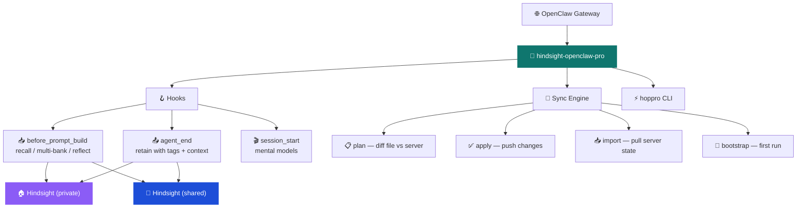

# 🧠 Hindsight OpenClaw Pro

> 🔌 Production-grade [Hindsight](https://vectorize.io/hindsight) memory plugin for [OpenClaw](https://openclaw.ai)
>
> Repository: `hindsight-astromech`


Per-agent bank configuration via IaC template files, multi-bank recall, session start context injection, reflect-on-recall, and a Terraform-style CLI (`hoppro`) for managing bank configurations.

| | Feature | Description |
|---|---------|-------------|
| 📋 | Per-agent config | Each agent gets a bank config template file — missions, entity labels, directives, dispositions |
| 🏗️ | Infrastructure as Code | `hoppro plan` / `apply` / `import` — Terraform-style bank management |
| 🔀 | Multi-bank recall | `recallFrom` lets an agent query multiple banks per turn (Yoda pattern) |
| 🧩 | Session start context | Mental models loaded at session start — no cold start problem |
| 🪞 | Reflect on recall | Disposition-aware reasoning via Hindsight reflect API |
| 🚀 | Bootstrap | First-run auto-apply of bank config to empty banks |
| 🏢 | Multi-server | Per-agent infrastructure overrides — private + shared Hindsight servers |

> [!IMPORTANT]
> This plugin replaces `@vectorize-io/hindsight-openclaw`.
> It is the **single memory provider** for the gateway — all agents must have a bank config.

---

## 🗺️ Architecture



---

## ⚡ Quick Start

### 1️⃣ Install

```bash
openclaw plugins install hindsight-openclaw-pro
```

### 2️⃣ Configure plugin

Add to `openclaw.json`:

```json5
{
  "plugins": {
    "entries": {
      "hindsight-openclaw-pro": {
        "enabled": true,
        "config": {
          "hindsightApiUrl": "https://hindsight.office.local",
          "hindsightApiToken": "...",
          "dynamicBankGranularity": ["agent"],
          "bootstrap": true,

          "agents": {
            "yoda":  { "bankConfig": "./banks/yoda.json5" },
            "r4p17": { "bankConfig": "./banks/r4p17.json5" },
            "bb8":   { "bankConfig": "./banks/default.json5" }
          }
        }
      }
    }
  }
}
```

### 3️⃣ Create bank config

Create `.openclaw/banks/yoda.json5`:

```json5
{
  // Server-side config
  "retain_mission": "Extract strategic decisions, priorities, risks, opportunities.",
  "reflect_mission": "You are the strategic advisor. Challenge assumptions.",
  "disposition_skepticism": 4,
  "disposition_literalism": 2,
  "disposition_empathy": 3,
  "entity_labels": [...],
  "directives": [
    { "name": "cross_department_honesty", "content": "Flag contradictions explicitly." }
  ],

  // Multi-bank recall
  "recallFrom": ["yoda", "r4p17", "bb9e", "bb8"],
  "recallBudget": "high",
  "recallMaxTokens": 2048,

  // Session start context
  "sessionStartModels": [
    { "type": "mental_model", "bankId": "yoda", "modelId": "strategic-position", "label": "Strategic Position" }
  ]
}
```

### 4️⃣ Apply & start

```bash
hoppro plan --all   # preview changes
hoppro apply --all  # apply to Hindsight server
openclaw gateway    # start with memory
```

---

## 🏛️ Configuration

### 📦 Two-Level Config System

```text
openclaw.json (plugin config)          banks/r4p17.json5 (bank config template)
├── Daemon (global only)               ├── Server-side (agent-only)
│   apiPort, embedPort, embedVersion   │   retain_mission, reflect_mission
│   embedPackagePath, daemonIdleTimeout│   dispositions, entity_labels, directives
│                                      │
├── Defaults (overridable per-agent)   ├── Infrastructure overrides (optional)
│   hindsightApiUrl, hindsightApiToken │   hindsightApiUrl, hindsightApiToken
│   dynamicBankGranularity, bankIdPfx  │   dynamicBankGranularity, bankIdPrefix
│   llmProvider, llmModel              │
│   autoRecall, autoRetain, ...        ├── Behavioral overrides (optional)
│                                      │   recallBudget, retainTags, llmModel, ...
├── Bootstrap: true|false              │
│                                      ├── Multi-bank: recallFrom [...]
└── Agent mapping                      ├── Session start: sessionStartModels [...]
    agents: { id: { bankConfig } }     └── Reflect: reflectOnRecall, reflectBudget
```

Resolution: `pluginDefaults → bankFile` — shallow merge, bank file wins.

### 🔌 Plugin Config Reference

| Option | Default | Per-agent | Description |
|--------|---------|-----------|-------------|
| `hindsightApiUrl` | — | ✅ | Hindsight API URL |
| `hindsightApiToken` | — | ✅ | Bearer token for API auth |
| `apiPort` | `9077` | ❌ | Port for local daemon (embed mode only) |
| `embedVersion` | `"latest"` | ❌ | `hindsight-embed` version |
| `embedPackagePath` | — | ❌ | Local `hindsight-embed` path (development) |
| `daemonIdleTimeout` | `0` | ❌ | Daemon idle timeout (0 = never) |
| `dynamicBankId` | `true` | ✅ | Derive bank ID from context |
| `dynamicBankGranularity` | `["agent","channel","user"]` | ✅ | Fields for bank ID derivation |
| `bankIdPrefix` | — | ✅ | Prefix for derived bank IDs |
| `autoRecall` | `true` | ✅ | Inject memories before each turn |
| `autoRetain` | `true` | ✅ | Retain conversations after each turn |
| `recallBudget` | `"mid"` | ✅ | Recall effort: `low`, `mid`, `high` |
| `recallMaxTokens` | `1024` | ✅ | Max tokens injected per turn |
| `recallTypes` | `["world","experience"]` | ✅ | Memory types to recall |
| `retainRoles` | `["user","assistant"]` | ✅ | Roles captured for retention |
| `retainEveryNTurns` | `1` | ✅ | Retain every Nth turn |
| `llmProvider` | auto | ✅ | LLM provider for extraction |
| `llmModel` | provider default | ✅ | Model name |
| `bootstrap` | `false` | ❌ | Auto-apply bank configs on first run |
| `agents` | `{}` | ❌ | Per-agent bank config registration |

### 📋 Bank Config File Reference

| Field | Type | Scope | Description |
|-------|------|-------|-------------|
| `retain_mission` | string | 🔧 Server | Guides fact extraction during retain |
| `observations_mission` | string | 🔧 Server | Controls observation consolidation |
| `reflect_mission` | string | 🔧 Server | Prompt for reflect operations |
| `retain_extraction_mode` | string | 🔧 Server | Extraction strategy (`concise`, `verbose`) |
| `disposition_skepticism` | 1–5 | 🔧 Server | How skeptical during extraction |
| `disposition_literalism` | 1–5 | 🔧 Server | How literally statements are interpreted |
| `disposition_empathy` | 1–5 | 🔧 Server | Weight given to emotional content |
| `entity_labels` | EntityLabel[] | 🔧 Server | Custom entity types for classification |
| `directives` | `{name,content}[]` | 🔧 Server | Standing instructions for the bank |
| `retainTags` | string[] | 🏷️ Tags | Tags added to all retained facts |
| `retainContext` | string | 🏷️ Tags | Source label for retained facts |
| `retainObservationScopes` | string \| string[][] | 🏷️ Tags | Observation consolidation scoping |
| `recallTags` | string[] | 🏷️ Tags | Filter recall results by tags |
| `recallTagsMatch` | `any\|all\|any_strict\|all_strict` | 🏷️ Tags | Tag filter mode |
| `recallFrom` | string[] | 🔀 Multi-bank | Banks to query (parallel recall) |
| `sessionStartModels` | SessionStartModelConfig[] | 🧩 Session | Mental models loaded at session start |
| `reflectOnRecall` | boolean | 🪞 Reflect | Use reflect instead of recall |
| `reflectBudget` | `low\|mid\|high` | 🪞 Reflect | Reflect effort level |
| `reflectMaxTokens` | number | 🪞 Reflect | Max tokens for reflect response |

All plugin-level behavioral options can also be overridden per-agent in the bank config file.

---

## 🌐 Multi-Server Support

Per-agent infrastructure overrides enable connecting different agents to different Hindsight servers:

```text
Gateway
├── 🏠 r4p17 (private)  → hindsightApiUrl: "https://hindsight.home.local"
├── 🏠 l337  (health)   → hindsightApiUrl: "https://hindsight.home.local"
├── 🏢 bb8   (company)  → hindsightApiUrl: "https://hindsight.office.local"
├── 🏢 bb9e  (company)  → hindsightApiUrl: "https://hindsight.office.local"
└── 🔧 cb23  (local)    → no hindsightApiUrl (local daemon)
```

---

## ⚡ CLI: hoppro

Terraform-style management of Hindsight bank configurations.

```bash
# 📋 Preview changes
hoppro plan --all
hoppro plan --agent r4p17

# ✅ Apply changes
hoppro apply --all
hoppro apply --agent r4p17

# 📥 Import server state to local file
hoppro import --agent r4p17 --output ./banks/r4p17.json5
```

| Command | Description |
|---------|-------------|
| `plan` | Diff local bank config files against Hindsight server state |
| `apply` | Apply changes shown by plan (config + directives) |
| `import` | Pull current server state into a local file |

Options: `--agent <id>`, `--all`, `--config <path>` (default: `.openclaw/openclaw.json`)

---

## 🔄 Migration from @vectorize-io/hindsight-openclaw

1. ❌ Remove `@vectorize-io/hindsight-openclaw`
2. ✅ Install `hindsight-openclaw-pro`
3. 📋 Move `bankMission` → bank config file as `retain_mission`
4. 📦 All other plugin-level options use the same names

> [!NOTE]
> Bank ID scheme is compatible — existing memories are preserved.
> No `agents` block = upstream-compatible mode (no bank config management).

---

## 🛠️ Development

```bash
npm install
npm run build              # 🔧 compile TypeScript → dist/
npm test                   # 🧪 unit tests (164 tests)
npm run test:integration   # 🔌 integration tests (requires Hindsight API)
```

| Variable | Default | Purpose |
|----------|---------|---------|
| `HINDSIGHT_API_URL` | `http://localhost:8888` | Hindsight server for integration tests |
| `HINDSIGHT_API_TOKEN` | — | Auth token for integration tests |

### 📁 Source Structure

```
src/
├── index.ts              # 🔌 Plugin entry: init + hook registration
├── client.ts             # 🌐 Stateless Hindsight HTTP client
├── types.ts              # 📝 Full type system
├── config.ts             # ⚙️ Config resolver + bank file parser
├── hooks/
│   ├── recall.ts         # 📥 Recall (single + multi-bank + reflect)
│   ├── retain.ts         # 📤 Retain (tags, context, observation_scopes)
│   └── session-start.ts  # 🎬 Session start (mental models)
├── sync/
│   ├── plan.ts           # 📋 Diff engine
│   ├── apply.ts          # ✅ Apply changes
│   ├── import.ts         # 📥 Import server state
│   └── bootstrap.ts      # 🚀 First-run apply
├── cli/
│   └── index.ts          # ⚡ hoppro CLI entry point
├── embed-manager.ts      # 🔧 Local daemon lifecycle
├── derive-bank-id.ts     # 🏷️ Bank ID derivation
└── format.ts             # 📝 Memory formatting
```

---

## 📚 Links

- [Hindsight Documentation](https://vectorize.io/hindsight)
- [OpenClaw Documentation](https://openclaw.ai)
- [Design Spec](docs/specs/2026-03-18-hindsight-astromech-v1-design.md)

## 📄 License

MIT
