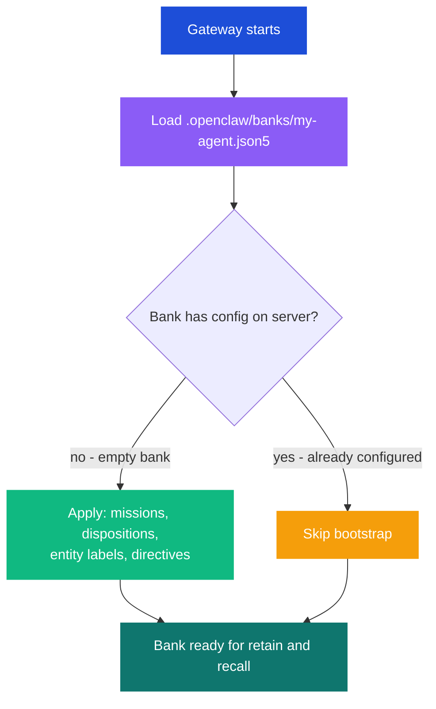

# Your First Bank Config

A **bank** is Hindsight's unit of memory storage. Each agent gets its own bank, and the bank config file controls what the agent remembers, how it extracts facts, and how it classifies information.

Bank configs are JSON5 files stored in `.openclaw/banks/`. When the gateway starts with `bootstrap: true`, hindclaw reads these files and applies them to the Hindsight server automatically.

## Create the file

Create `.openclaw/banks/my-agent.json5`:

```json5
// .openclaw/banks/my-agent.json5
{
  "bank_id": "my-agent",

  "retain_mission": "Extract important decisions, preferences, project context, and action items. Ignore greetings, filler, and small talk.",

  "observations_mission": "Identify recurring patterns, evolving preferences, and long-term context. Focus on durable insights over transient states.",

  "reflect_mission": "You are a helpful assistant. Use past context to personalize responses. Be direct and resourceful.",

  "disposition_skepticism": 3,
  "disposition_literalism": 3,
  "disposition_empathy": 3,

  "entity_labels": [
    {
      "key": "project",
      "description": "Which project this fact relates to",
      "type": "multi-values",
      "tag": true,
      "optional": true,
      "values": [
        {"value": "backend",  "description": "Backend services and APIs"},
        {"value": "frontend", "description": "Frontend web application"},
        {"value": "infra",    "description": "Infrastructure and DevOps"},
        {"value": "general",  "description": "Not project-specific"}
      ]
    }
  ],

  "directives": [
    {
      "name": "precision",
      "content": "When extracting dates, amounts, or version numbers, preserve them exactly. Do not round or approximate."
    }
  ]
}
```

The `bank_id` must match the agent's ID in your OpenClaw config. When the gateway starts, hindclaw looks for a file named `{agent-id}.json5` in the banks directory.

## Field reference

### Missions

Missions are natural-language instructions that tell Hindsight how to process conversations for this bank.

| Field | Purpose |
|-------|---------|
| `retain_mission` | Guides the LLM during fact extraction. Tells it what to extract and what to ignore. This is the most important field -- it defines what the agent remembers. |
| `observations_mission` | Controls how extracted facts are consolidated into higher-level observations over time. Think of it as "what patterns should the system notice?" |
| `reflect_mission` | Sets the persona when the agent uses reflect-on-recall (reasoning over memories instead of raw retrieval). Only used if `reflectOnRecall: true` is enabled. |

### Dispositions

Dispositions are numeric scales (1-5) that tune the LLM's behavior during fact extraction. They apply globally to all extraction for this bank.

#### `disposition_skepticism` (1-5)

How critically the system evaluates claims before storing them.

| Value | Behavior |
|-------|----------|
| 1 | Accepts everything at face value. Stores claims, opinions, and speculation without qualification. |
| 2 | Mostly trusting. Stores most statements but may note obvious contradictions. |
| 3 | Balanced (default). Stores factual statements directly, flags uncertain claims. |
| 4 | Skeptical. Requires supporting context for claims. Qualifies uncertain statements. |
| 5 | Highly critical. Only stores well-supported facts. Rejects vague or unsupported claims. |

#### `disposition_literalism` (1-5)

How literally vs. interpretively the system reads statements.

| Value | Behavior |
|-------|----------|
| 1 | Heavily interprets. Infers intent, reads between the lines, captures implied meaning. |
| 2 | Mostly interpretive. Captures both what was said and likely intent. |
| 3 | Balanced (default). Captures statements as-is with light inference where obvious. |
| 4 | Mostly literal. Stores what was explicitly stated. Minimal inference. |
| 5 | Strictly literal. Only stores exactly what was said, word-for-word meaning. |

#### `disposition_empathy` (1-5)

How much weight is given to emotional and relational content.

| Value | Behavior |
|-------|----------|
| 1 | Ignores emotional content entirely. Only stores factual, objective information. |
| 2 | Minimal emotional awareness. Captures strong emotional statements only. |
| 3 | Balanced (default). Captures emotions when they provide useful context. |
| 4 | Emotionally attentive. Tracks sentiment, preferences, frustrations, and satisfaction. |
| 5 | Highly empathetic. Treats emotional content as primary data. Stores tone, mood, and relational dynamics. |

### Entity labels

Entity labels define custom classification dimensions for extracted facts. Each label creates a tagging axis that Hindsight uses to categorize and filter memories.

```json5
"entity_labels": [
  {
    "key": "project",
    "description": "Which project this fact relates to",
    "type": "multi-values",
    "tag": true,
    "optional": true,
    "values": [
      {"value": "backend",  "description": "Backend services and APIs"},
      {"value": "frontend", "description": "Frontend web application"}
    ]
  }
]
```

| Property | Type | Description |
|----------|------|-------------|
| `key` | string | Unique identifier for this label dimension |
| `description` | string | Tells the LLM when to apply this label |
| `type` | string | `"multi-values"` -- the fact can have one or more values from the list |
| `tag` | boolean | When `true`, label values become searchable tags on the extracted fact |
| `optional` | boolean | When `true`, the LLM can skip this label if it does not apply |
| `values` | array | The allowed values with descriptions to guide classification |

**Practical example:** A car service business might use entity labels to classify memories by department and service type:

```json5
"entity_labels": [
  {
    "key": "department",
    "description": "Which department this fact relates to",
    "type": "multi-values",
    "tag": true,
    "values": [
      {"value": "service",   "description": "Car repair and maintenance"},
      {"value": "detailing", "description": "Car wash, polish, coating"},
      {"value": "parts",     "description": "Spare parts inventory and ordering"}
    ]
  },
  {
    "key": "priority",
    "description": "Urgency or importance level",
    "type": "multi-values",
    "tag": true,
    "optional": true,
    "values": [
      {"value": "urgent",  "description": "Needs immediate attention"},
      {"value": "normal",  "description": "Standard priority"},
      {"value": "low",     "description": "Nice to have, no deadline"}
    ]
  }
]
```

When the agent processes a conversation like "We need to order brake pads for the service bay urgently," Hindsight extracts the fact and tags it with `department:service` and `priority:urgent`. These tags make the memory filterable during recall.

### Directives

Directives are standing instructions that persist across all conversations for this bank. They act as permanent rules for the extraction LLM.

```json5
"directives": [
  {
    "name": "precision",
    "content": "Preserve exact numbers, dates, and version strings. Never round or approximate."
  },
  {
    "name": "cross_reference",
    "content": "When a fact references multiple departments, tag all relevant departments."
  }
]
```

Each directive needs a unique `name` (used as an identifier for updates and deletes) and `content` (the instruction text). Directives are managed as infrastructure -- if you remove a directive from the file and run `hindclaw apply`, it gets deleted from the server.

## What happens at startup

When the gateway starts and `bootstrap: true` is set in the plugin config, the following sequence runs for each agent:



Bootstrap only fires once -- it checks whether the bank already has configuration on the server. If the bank has any existing overrides, bootstrap skips it. This prevents accidental overwrites.

After the initial bootstrap, use `hindclaw plan` and `hindclaw apply` to manage changes:

```bash
hindclaw plan --agent my-agent    # preview what would change
hindclaw apply --agent my-agent   # apply changes to the server
```

## Splitting large configs with $include

As your bank config grows, you can split it into multiple files using `$include` directives:

```json5
// .openclaw/banks/my-agent.json5
{
  "bank_id": "my-agent",
  "retain_mission": "Extract decisions and project context.",
  "entity_labels": { "$include": "./my-agent/entity-labels.json5" },
  "directives": { "$include": "./my-agent/directives.json5" }
}
```

```
.openclaw/banks/
  my-agent.json5
  my-agent/
    entity-labels.json5
    directives.json5
```

Paths are resolved relative to the file containing the `$include`. Maximum nesting depth is 10, and circular references are detected.

## Next steps

Your agent now has a configured memory bank. The next step is to verify that memory operations are working end to end.

Next: [Verify memory is working](./verify.md) to confirm retain, recall, and the Hindsight UI.
