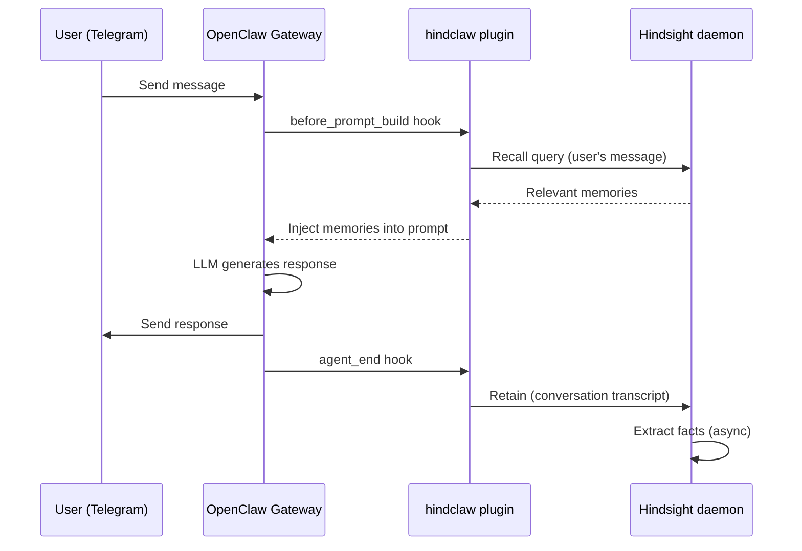

# Verify Memory Works

After installing hindclaw and creating your first bank config, you need to confirm that memory operations are running end to end. This guide covers four checkpoints: gateway logs, a live message test, CLI recall, and the Hindsight UI.

## Checkpoint 1: Gateway logs

Start (or restart) the gateway and watch the logs:

```bash
just restart && just logs-follow
```

On startup, look for these `[Hindsight]` lines:

```
[Hindsight] Plugin initialized
[Hindsight] Bootstrap: checking bank my-agent config...
[Hindsight] Bootstrap: applying 5 config fields to bank my-agent
[Hindsight] Bootstrap: creating 1 directives for bank my-agent
```

This confirms:
- The plugin loaded and connected to the Hindsight daemon (or remote server)
- It found your bank config file
- It applied the config to the server (first run only -- subsequent starts will show "already has N overrides -- skipping")

If you do not see `[Hindsight]` lines at all, the plugin may not be enabled. Check that your plugins config has `"enabled": true` and `"slots": { "memory": "hindclaw" }`.

## Checkpoint 2: Send a test message

Send a message to your agent through Telegram (or whichever channel you use). Something with a concrete fact works best:

> "Remember that our next deployment is scheduled for Friday at 3pm."

Watch the gateway logs. You should see two phases:

**Recall (before the agent responds):**

```
[Hindsight] before_prompt_build - bank: my-agent, channel: telegram/12345
[Hindsight] Auto-recall for bank my-agent, full query:
---
Remember that our next deployment is scheduled for Friday at 3pm.
---
```

**Retain (after the agent responds):**

```
[Hindsight] Retaining to bank my-agent, document: session-abc123, chars: 342
[Hindsight] Retained 2 messages to bank my-agent for session session-abc123
```

The retain step means the conversation was sent to Hindsight for fact extraction. The extraction happens asynchronously on the Hindsight side -- the gateway does not wait for it to complete.

## Checkpoint 3: Query memories with the CLI

Wait about 10-15 seconds after sending your test message (Hindsight needs time to extract and index the facts). Then use `hindsight-embed recall` to query directly:

```bash
hindsight-embed -p openclaw recall --bank my-agent "deployment schedule"
```

You should see the extracted fact about the Friday deployment in the results. If you get no results, wait a bit longer -- extraction latency depends on the LLM provider and model.

You can also check what the bank looks like on the server:

```bash
hindclaw plan --agent my-agent
```

If the plan shows no changes, your local config and server state are in sync (which is what you want after a successful bootstrap).

## Checkpoint 4: Open the Hindsight UI

Hindsight includes a web UI for browsing banks, facts, and the knowledge graph. Launch it with:

```bash
hindsight-embed -p openclaw ui
```

This opens the UI in your browser, connected to the correct daemon port from your `openclaw` profile. You can:

- Browse your agent's bank and see extracted facts
- View the knowledge graph relationships
- Check entity label tags on individual facts
- Verify that directives were applied

:::caution
Use `hindsight-embed -p openclaw ui`, not `hindsight ui`. The `-p openclaw` flag ensures the UI connects to the right daemon port. Without it, you may connect to a different profile or get a connection error.
:::

## Common issues

### Daemon not running

**Symptom:** Gateway logs show connection errors like `ECONNREFUSED` on port 9077.

**Fix:** The daemon should start automatically when the gateway initializes. If it does not, start it manually:

```bash
hindsight-embed -p openclaw serve
```

Then restart the gateway. Check that `hindsight-embed` is installed and the `openclaw` profile exists:

```bash
hindsight-embed -p openclaw status
```

### Wrong API port

**Symptom:** Plugin initializes but all recall/retain calls fail with connection errors.

**Fix:** The default daemon port is `9077`. If your profile uses a different port, set it in the plugin config:

```json5
{
  "config": {
    "apiPort": 9077
  }
}
```

The port must match what `hindsight-embed configure -p openclaw` set. You can check your profile's port with:

```bash
hindsight-embed -p openclaw status
```

### Bootstrap did not fire

**Symptom:** Gateway starts, but you see "already has N overrides -- skipping" even though the bank is new.

**Cause:** Bootstrap checks for any existing overrides on the server. If a previous run partially applied config, or if you manually configured the bank via the API, bootstrap considers it already set up.

**Fix:** Use the CLI to apply your config explicitly:

```bash
hindclaw plan --agent my-agent     # see what differs
hindclaw apply --agent my-agent    # apply the changes
```

### No retain lines in logs

**Symptom:** Recall works, but you never see "Retaining to bank" in the logs.

**Possible causes:**
- `autoRetain` is set to `false` in your plugin or bank config
- The agent's response did not include any retainable roles (check `retainRoles` -- default is `["user", "assistant"]`)
- `retainEveryNTurns` is set to a value greater than 1, so retention only fires every Nth turn

### Recall returns empty results

**Symptom:** Retain lines appear in logs, but recall always returns nothing.

**Possible causes:**
- Extraction has not completed yet -- wait 10-15 seconds and try again
- The LLM provider for extraction is not configured or the API key is missing
- The `recallTypes` filter is too restrictive -- default is `["world", "experience"]`
- `autoRecall` is set to `false`

## The full message flow

Here is what happens for every message, end to end:



The recall step adds context before the LLM sees the prompt. The retain step captures facts after the turn completes. Both run automatically on every turn (unless configured otherwise).

## Next steps

Memory is working. From here you can:

- Add more agents with their own bank configs in `.openclaw/banks/`
- Set up [named retain strategies](/docs/guides/bank-configs#named-retain-strategies) to route different topics to different extraction rules
- Configure [access control](/docs/guides/access-control) for multi-user deployments
- Enable [cross-agent recall](/docs/guides/multi-bank-recall) so agents can read each other's memories
