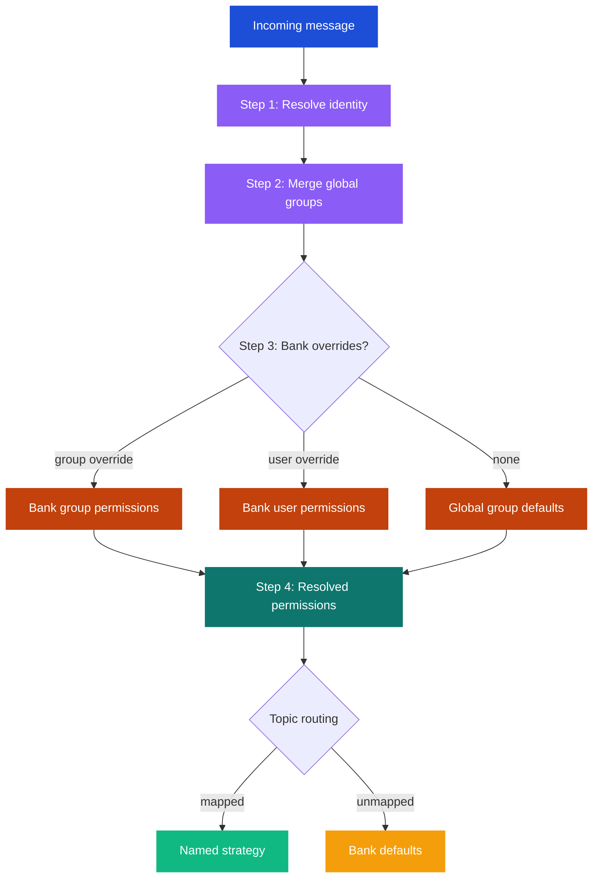

# Access Control

hindclaw provides per-user memory permissions resolved through a 4-layer system. The same user can get different behavior on different agents -- different access flags, different LLM models, different recall budgets, different tag visibility.

## Directory structure

Access control is configured through a self-contained directory:

```
.openclaw/hindsight/
├── config.json5           # Plugin settings
├── banks/
│   ├── yoda.json5         # Bank config (file name = agent ID)
│   ├── yoda/              # $include fragments
│   └── ...
├── groups/
│   ├── _default.json5     # REQUIRED -- anonymous/unknown users
│   ├── executives.json5
│   ├── staff.json5
│   └── sales-team.json5
└── users/
    ├── alice.json5         # Canonical ID = file name
    ├── bob.json5
    └── ...
```

Enable access control by setting `configPath` in your plugin config:

```json5
// In openclaw.json (or $include'd plugin config)
"hindclaw": {
  "enabled": true,
  "configPath": "./hindsight"
}
```

You can scaffold this structure with:

```bash
hindclaw init                    # Empty templates
hindclaw init --from-existing    # Migrate current config + banks
```

## Users

A user file defines identity mapping -- how the system recognizes the same person across channels. No permissions, no group membership. Just identity.

```json5
// users/alice.json5
{
  "displayName": "Alice",
  "email": "alice@example.com",
  "channels": {
    "telegram": "123456",
    "slack": "U123456"
  }
}
```

The `channels` map links platform-specific sender IDs to the canonical user. When a message arrives from Telegram user `123456`, hindclaw resolves it to the user `alice` and looks up her group memberships.

The canonical user ID is the file name (without extension).

## Groups

A group file defines who belongs to it and what permissions they get. There are two common patterns: role groups and department groups.

### Role groups

Role groups control access levels and behavioral parameters:

```json5
// groups/executives.json5
{
  "displayName": "Executive",
  "members": ["alice"],
  "recall": true,
  "retain": true,
  "retainRoles": ["user", "assistant", "tool"],
  "retainTags": ["role:executive"],
  "recallBudget": "high",
  "recallMaxTokens": 2048,
  "recallTagGroups": null,
  "llmModel": "claude-sonnet-4-5-20250929"
}
```

```json5
// groups/staff.json5
{
  "displayName": "Staff",
  "members": ["bob", "charlie"],
  "recall": true,
  "retain": true,
  "retainRoles": ["assistant"],
  "retainTags": ["role:staff"],
  "retainEveryNTurns": 2,
  "recallBudget": "low",
  "recallMaxTokens": 512,
  "recallTagGroups": [
    {"not": {"tags": ["sensitivity:restricted"], "match": "any_strict"}}
  ],
  "llmProvider": "openai",
  "llmModel": "gpt-4o-mini"
}
```

Key difference: executives see everything (`recallTagGroups: null` means no filter), while staff are filtered -- they never see facts tagged `sensitivity:restricted`.

### Department groups

Department groups add contextual tags without changing access levels:

```json5
// groups/sales-team.json5
{
  "displayName": "Sales Team",
  "members": ["bob", "charlie"],
  "recallTagGroups": [
    {"tags": ["department:sales"], "match": "any"}
  ],
  "retainTags": ["department:sales"]
}
```

A user can belong to both a role group and a department group. The merge rules (below) combine their permissions.

### The _default fallback

The `_default.json5` group is required. It applies to any user not found in the user directory -- anonymous or unknown senders.

```json5
// groups/_default.json5
{
  "displayName": "Anonymous",
  "members": [],
  "recall": false,
  "retain": false
}
```

This blocks unknown users from both reading and writing memory. Adjust as needed -- you might want `"recall": true` for read-only anonymous access.

## Configurable fields

Every field below can be set at the group level, and overridden at the bank level per-group or per-user:

| Field | Type | Description |
|---|---|---|
| `recall` | boolean | Can read from memory |
| `retain` | boolean | Can write to memory |
| `retainRoles` | string[] | Message roles retained: `user`, `assistant`, `system`, `tool` |
| `retainTags` | string[] | Tags added to all retained facts |
| `retainEveryNTurns` | number | Retain every Nth turn |
| `recallBudget` | `low` / `mid` / `high` | Recall effort level |
| `recallMaxTokens` | number | Max tokens injected per turn |
| `recallTagGroups` | TagGroup[] or null | Tag filter for recall (`null` = no filter) |
| `llmModel` | string | LLM model for extraction |
| `llmProvider` | string | LLM provider for extraction |
| `excludeProviders` | string[] | Skip these message providers |

That is 11 configurable fields at every layer.

## Merge rules

When a user belongs to multiple groups, their permissions are merged field by field:

| Field | Merge rule |
|---|---|
| `recall`, `retain` | Most permissive wins (`true` beats `false`) |
| `retainRoles`, `retainTags` | Unioned (all values combined) |
| `recallBudget` | Most permissive (`high` > `mid` > `low`) |
| `recallMaxTokens` | Highest value wins |
| `recallTagGroups` | AND-ed together (all filters must pass) |
| `llmModel`, `llmProvider` | Alphabetically first group that defines it wins |
| `retainEveryNTurns` | Lowest value wins (most frequent retention) |
| `excludeProviders` | Unioned (most restrictive -- more providers excluded) |

Example: Bob is in both `staff` (recallBudget: low) and `sales-team`. If `sales-team` does not define `recallBudget`, Bob keeps `low`. If it defined `high`, Bob would get `high` (most permissive wins).

## Bank-level permission overrides

Each bank config can override group defaults for specific groups or users. This is how the same user gets different behavior on different agents.

```json5
// banks/yoda.json5
{
  "retain_mission": "...",

  "permissions": {
    "groups": {
      "executives":  { "recall": true, "retain": true },
      "staff":       { "recall": true, "retain": false },
      "_default":    { "recall": false, "retain": false }
    },
    "users": {
      "bob": { "recallBudget": "high", "recallMaxTokens": 2048 }
    }
  }
}
```

In this example, Bob (a staff member) gets elevated recall on Yoda specifically -- high budget and 2048 tokens instead of the staff default of low/512.

## The 4-step resolution algorithm

For each incoming message, permissions are resolved per-field through 4 layers. Most specific wins:



The steps in detail:

1. **Resolve identity** -- Match the incoming `provider:senderId` (e.g., `telegram:123456`) to a canonical user via their `channels` map. If no match, the user is anonymous.

2. **Merge global groups** -- Find all groups the user belongs to. Merge their permissions using the rules above. If the user is anonymous, only `_default` applies.

3. **Bank group overlay** -- If the target bank has `permissions.groups` entries for any of the user's groups, overlay those on top of the merged global result. Then if the bank has a `permissions.users` entry for this user, overlay that.

4. **Final resolved permissions** -- The result is a single flat object with all 11 fields resolved. This is what the recall and retain hooks use.

Banks without a `permissions` block fall through to global group defaults (backward compatible).

## Tag-based filtering with recallTagGroups

`recallTagGroups` uses Hindsight's tag filtering API to control what memories a user can see during recall. Tags on facts come from two sources:

1. **Code-level tags** -- `retainTags` from groups (e.g., `role:executive`) plus automatic `user:<id>` tags
2. **LLM-extracted tags** -- Entity labels with `tag: true` in the bank config (e.g., `department:motors`, `sensitivity:restricted`)

Filter examples:

```json5
// See everything (no filter)
"recallTagGroups": null

// Exclude restricted content
"recallTagGroups": [
  {"not": {"tags": ["sensitivity:restricted"], "match": "any_strict"}}
]

// Only see sales department content
"recallTagGroups": [
  {"tags": ["department:sales"], "match": "any"}
]

// Complex: see sales OR motors, but never restricted
"recallTagGroups": [
  {"or": [
    {"tags": ["department:sales"], "match": "any"},
    {"tags": ["department:motors"], "match": "any"}
  ]},
  {"not": {"tags": ["sensitivity:restricted"], "match": "any_strict"}}
]
```

## Practical example

Three users, two agents, different access:

| | yoda (strategic) | k2so (operations) |
|---|---|---|
| **alice** (executive) | recall + retain, high budget, no tag filter | recall + retain, high budget, no tag filter |
| **bob** (staff, sales) | recall only (bank override), mid budget | recall + retain, high budget (user override) |
| **anonymous** | blocked | blocked |

This requires:
- `groups/executives.json5` with alice, full access
- `groups/staff.json5` with bob, limited access
- `banks/yoda.json5` with `permissions.groups.staff.retain: false`
- `banks/k2so.json5` with `permissions.users.bob.recallBudget: "high"`
- `groups/_default.json5` blocking both recall and retain
