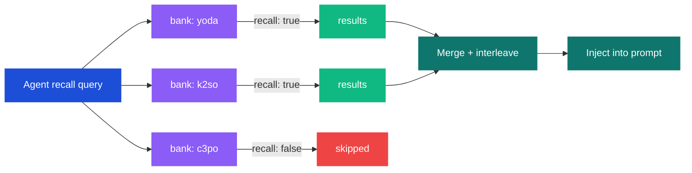

# Cross-Agent Recall

An agent can recall memories from multiple banks in parallel. This lets one agent draw on knowledge from across the fleet -- a strategic advisor reading from the operations agent's bank, or a knowledge librarian pulling from every agent in the system.

## How it works

When an agent with `recallFrom` configured receives a message, it sends the same recall query to all listed banks simultaneously. Results from each bank are interleaved using round-robin and injected into the prompt as a single combined context.



## Configuration

Add `recallFrom` to the agent's bank config. Each entry specifies a bank ID and optional per-bank overrides:

```json5
// .openclaw/banks/yoda.json5
{
  "recallFrom": [
    { "bankId": "yoda" },
    { "bankId": "k2so", "budget": "low", "maxTokens": 512 },
    { "bankId": "c3po", "budget": "low", "maxTokens": 512 }
  ],
  "recallBudget": "high",
  "recallMaxTokens": 2048
}
```

Note that the agent's own bank should be included in the list if you want it to recall from itself. The `recallFrom` list replaces the default single-bank behavior -- it does not add to it.

### Per-bank overrides

Each entry in `recallFrom` accepts:

| Field | Type | Description |
|---|---|---|
| `bankId` | string | Target bank ID (required) |
| `budget` | `low` / `mid` / `high` | Override recall effort for this bank |
| `maxTokens` | number | Override max tokens for this bank |
| `types` | string[] | Override memory types (`world`, `experience`, `observation`) |
| `tagGroups` | TagGroup[] | Override tag filter for this bank |

Fields not specified fall back to the agent's top-level `recallBudget` and `recallMaxTokens`.

## Permission checks

When access control is active, permissions are checked independently for each target bank. The requesting user must have `recall: true` on each bank they read from.

If the current user has `recall: false` on bank `c3po` (resolved through the [4-step permission algorithm](./access-control.md#the-4-step-resolution-algorithm)), that bank is silently skipped. The agent still recalls from the remaining permitted banks.

This means cross-agent recall respects the same access control rules as single-bank recall. No unauthorized cross-reads.

## Round-robin interleave

Results from multiple banks are merged using round-robin interleaving -- one result from each bank in turn, cycling until all results are exhausted. This prevents any single bank from dominating the context window.

Given three banks returning 4, 2, and 3 results respectively:

```
Bank A: [A1, A2, A3, A4]
Bank B: [B1, B2]
Bank C: [C1, C2, C3]

Interleaved: [A1, B1, C1, A2, B2, C2, A3, C3, A4]
```

The interleaved results are then formatted and injected into the prompt as a single `<hindsight_memories>` block.

## Budget distribution

Each bank in `recallFrom` makes its own recall request with its own budget and token limit. The budgets are not split from a global pool -- each bank gets the full budget specified in its entry (or the agent-level default).

A practical pattern is to give the agent's own bank a higher budget and secondary banks a lower one:

```json5
{
  "recallFrom": [
    { "bankId": "yoda", "budget": "high", "maxTokens": 2048 },
    { "bankId": "k2so", "budget": "low", "maxTokens": 256 },
    { "bankId": "c3po", "budget": "low", "maxTokens": 256 }
  ]
}
```

This prioritizes the agent's own memories while still pulling relevant context from other banks.

## In-flight deduplication

Concurrent recall requests for the same bank and query are deduplicated automatically. If two hooks trigger recall for the same bank with the same query text, only one HTTP request is made. This is transparent and requires no configuration.

## Practical example

A CEO advisor agent (yoda) that draws from the operations agent (k2so) and the knowledge librarian (c3po):

```json5
// .openclaw/banks/yoda.json5
{
  "retain_mission": "Extract strategic decisions and cross-departmental patterns.",

  "recallFrom": [
    { "bankId": "yoda" },
    { "bankId": "k2so", "budget": "low", "maxTokens": 512 },
    { "bankId": "c3po", "budget": "low", "maxTokens": 512 }
  ],
  "recallBudget": "high",
  "recallMaxTokens": 2048
}
```

When alice asks yoda "What did we decide about the office expansion?", yoda sends the query to all three banks in parallel, checks alice's permissions on each, interleaves the results, and injects them into the prompt. The response draws on yoda's strategic context, k2so's operational details, and c3po's documented knowledge.
