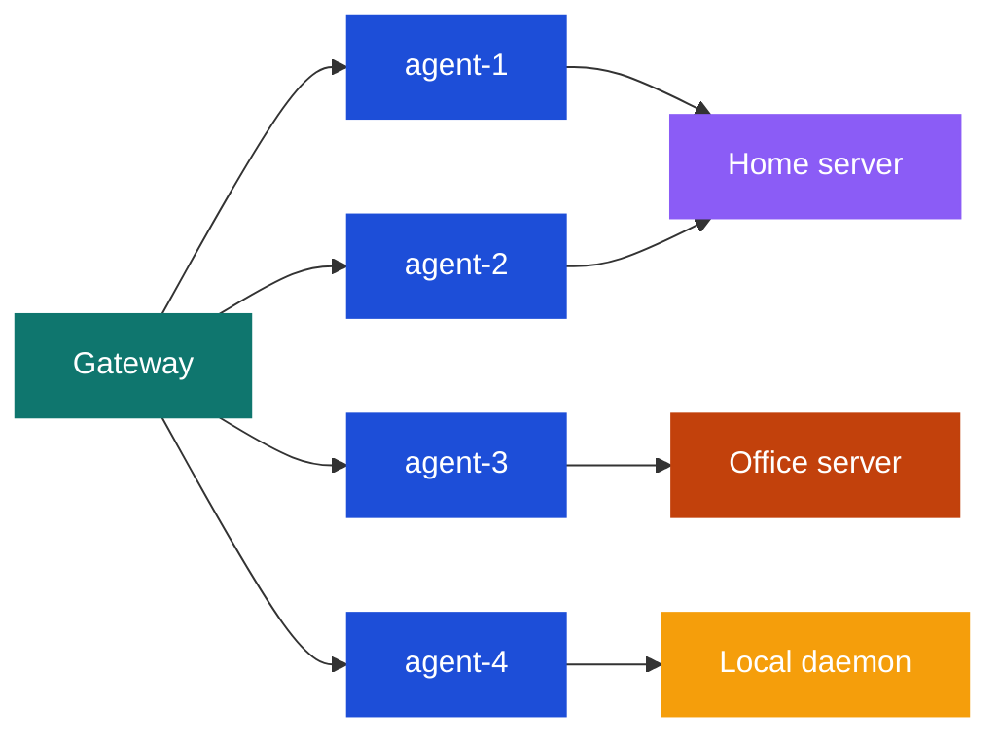

# Multi-Server Setup

hindclaw supports per-agent infrastructure routing -- different agents in the same gateway can connect to different Hindsight servers. This enables scenarios like separating personal and company memory, or mixing a local daemon with remote servers.

## How it works

The plugin resolves `hindsightApiUrl` per-agent. The default is the local daemon (started automatically), but any agent can override it to point at a different server.



One gateway, one plugin instance, multiple Hindsight backends.

## Configuration

### Plugin-level default

Set a default Hindsight server in the plugin config. All agents use this unless overridden:

```json5
// In openclaw.json (or $include'd config)
"hindclaw": {
  "enabled": true,
  "config": {
    "hindsightApiUrl": "https://hindsight.home.local",
    "hindsightApiToken": "home-token-here"
  }
}
```

### Per-agent override

Override the URL in a bank config file to point an agent at a different server:

```json5
// .openclaw/banks/k2so.json5
{
  "hindsightApiUrl": "https://hindsight.office.local",
  "hindsightApiToken": "office-token-here",

  "retain_mission": "Extract operational decisions, task assignments, and deadlines."
}
```

### Mixing local daemon and remote servers

If some agents should use the local daemon (no URL override) and others should use a remote server, simply omit `hindsightApiUrl` for the local agents:

```json5
// .openclaw/banks/r2d2.json5 -- uses local daemon (default)
{
  "retain_mission": "Track personal tasks and preferences."
}
```

```json5
// .openclaw/banks/k2so.json5 -- uses office server
{
  "hindsightApiUrl": "https://hindsight.office.local",
  "hindsightApiToken": "office-token-here",
  "retain_mission": "Track company operations."
}
```

The local daemon starts automatically when any agent uses it. Agents pointing at remote servers do not trigger the daemon.

## Use cases

### Home vs office separation

Keep personal memories on a home server and company memories on an office server:

```
Gateway
├── yoda    (private)   --> https://hindsight.home.local
├── r2d2    (private)   --> https://hindsight.home.local
├── k2so    (company)   --> https://hindsight.office.local
├── c3po    (company)   --> https://hindsight.office.local
└── l3-37   (health)    --> local daemon (no URL)
```

This keeps data physically separated. Personal conversations never leave the home network; company data stays on the office server.

### Development and production

Use a local daemon for development agents while production agents connect to a stable remote server:

```json5
// .openclaw/banks/dev-agent.json5
{
  // No hindsightApiUrl -- uses local daemon
  "retain_mission": "Development testing."
}
```

```json5
// .openclaw/banks/prod-agent.json5
{
  "hindsightApiUrl": "https://hindsight.prod.internal",
  "hindsightApiToken": "prod-token",
  "retain_mission": "Production knowledge extraction."
}
```

### Multi-tenant deployment

In a shared gateway serving multiple organizations, each tenant's agents can point to their own Hindsight instance:

```json5
// .openclaw/banks/tenant-a-agent.json5
{
  "hindsightApiUrl": "https://hindsight.tenant-a.local",
  "hindsightApiToken": "tenant-a-token"
}
```

```json5
// .openclaw/banks/tenant-b-agent.json5
{
  "hindsightApiUrl": "https://hindsight.tenant-b.local",
  "hindsightApiToken": "tenant-b-token"
}
```

## Cross-agent recall across servers

When an agent uses `recallFrom` to recall from another agent's bank, the target bank must be accessible from the same Hindsight server. Cross-server recall (agent on server A recalling from a bank on server B) is not supported -- all banks in a `recallFrom` list must be on the same server as the requesting agent.

If you need cross-server knowledge sharing, consider using [session start models](./session-context.md) to pre-load context from different servers at session start.

## Authentication

Each server can have its own authentication token. Set `hindsightApiToken` alongside `hindsightApiUrl` in either the plugin config (for the default) or the bank config (for per-agent overrides).

Tokens should be stored securely. If your gateway config supports environment variable references, use those instead of hardcoding tokens:

```json5
{
  "hindsightApiUrl": "https://hindsight.office.local",
  "hindsightApiToken": "${HINDSIGHT_OFFICE_TOKEN}"
}
```

## CLI with multi-server

The `hindclaw` CLI resolves the correct server URL per-agent, so commands work transparently:

```bash
# This hits the office server (resolved from k2so's bank config)
hindclaw plan --agent k2so

# This hits the home server (resolved from yoda's bank config)
hindclaw plan --agent yoda

# This hits each agent's respective server
hindclaw plan --all
```

You can also override the URL on the command line for one-off operations:

```bash
hindclaw plan --agent k2so --api-url https://hindsight.staging.local
```
