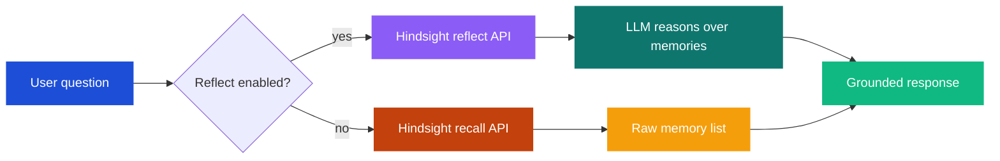

# Reflect on Recall

By default, hindclaw uses **recall** -- it retrieves individual memory facts and injects them as a raw list into the prompt. **Reflect** is an alternative mode where the Hindsight server first reasons over the retrieved memories using an LLM, then returns a synthesized response instead of raw facts.

## Recall vs reflect



With **recall**, the agent receives a list of individual facts like:

```
- User prefers morning meetings
- Q3 revenue was $2.4M, up 15% from Q2
- Decision: delay expansion until cash reserves reach $500K
- Bob raised concerns about staffing in the Sept 12 review
```

The agent must then synthesize these into a coherent response.

With **reflect**, the Hindsight server retrieves the same memories internally, passes them to an LLM with the user's query, and returns a pre-reasoned response. The agent receives something like:

> Based on stored knowledge: The Q3 revenue increase to $2.4M suggests the expansion conditions are approaching, but the $500K cash reserve threshold from the September decision has not been confirmed as met. Bob's staffing concerns from the Sept 12 review remain unresolved and could impact expansion timelines.

The reflect response is grounded in the same memories, but the reasoning happens server-side before reaching the agent.

## How reflect works

1. The user sends a message
2. hindclaw extracts a recall query from the message (same as normal recall)
3. Instead of calling the recall API, it calls the reflect API on the primary bank
4. The Hindsight server retrieves relevant memories, passes them to its configured LLM along with the query, and generates a reasoned response
5. The response is injected into the agent's prompt in a `<hindsight_memories>` block

The reflect mission defined in the bank config (`reflect_mission`) guides how the server-side LLM reasons:

```json5
{
  "reflect_mission": "You are the strategic advisor. Reason critically over stored knowledge. Challenge assumptions, surface contradictions, and connect facts across time periods."
}
```

## Configuration

Enable reflect in the agent's bank config:

```json5
// .openclaw/banks/yoda.json5
{
  "reflectOnRecall": true,
  "reflectBudget": "high",

  // Server-side: how the reflect LLM reasons
  "reflect_mission": "You are the strategic advisor. Challenge assumptions and surface non-obvious connections."
}
```

### Fields

| Field | Type | Default | Description |
|---|---|---|---|
| `reflectOnRecall` | boolean | `false` | Use reflect instead of recall |
| `reflectBudget` | `low` / `mid` / `high` | Falls back to `recallBudget` | Effort level for reflect |
| `reflectMaxTokens` | number | Falls back to `recallMaxTokens` | Max tokens for reflect response |
| `reflect_mission` | string | -- | Server-side prompt guiding the reasoning LLM |

`reflectBudget` controls how much effort the server-side LLM puts into reasoning. Higher budgets retrieve more memories and produce more detailed responses but cost more tokens and take longer.

## When to use reflect vs recall

**Use reflect when:**
- The agent's role requires synthesis (strategic advisor, analyst, planner)
- Questions are open-ended ("What should we consider for the expansion?")
- You want the agent to surface connections between facts rather than listing them
- You have a well-defined `reflect_mission` that matches the agent's persona

**Use recall when:**
- The agent needs raw facts for precise answers ("When was the last board meeting?")
- You want maximum control over how memories are presented to the agent
- Token budget is tight (reflect uses additional tokens server-side)
- The agent serves multiple roles and needs flexible context interpretation

**Performance note:** Reflect adds server-side LLM inference on top of memory retrieval. This means higher latency and token cost compared to recall. The tradeoff is richer, pre-reasoned context.

## Reflect with access control

When access control is active, reflect respects the same tag filters as recall. The `recallTagGroups` resolved for the current user are passed to the reflect API, so the server-side LLM only reasons over memories the user is permitted to see.

## Reflect and multi-bank

Reflect operates on the **primary bank only**. If the agent also has `recallFrom` configured, reflect is used for the primary bank while the secondary banks still use standard recall. The results are combined.

This is intentional -- reflect's reasoning is tied to the bank's `reflect_mission`, which is agent-specific. Applying one agent's reflect mission to another agent's memories would produce incoherent results.
