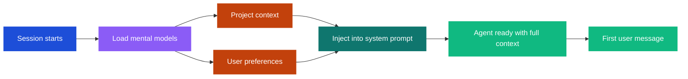

# Session Start Context

When a new conversation session begins, hindclaw can load mental models from Hindsight and inject them into the system prompt before the first user message arrives. This eliminates the cold start problem -- the agent starts with relevant context already in place.

## The cold start problem

Without session start context, an agent's first response in a new session has no memory context. Recall only triggers when a user message arrives, so the first turn must complete before any memories are retrieved. Session start models fix this by pre-loading context before the conversation begins.

## How it works



When a session starts, the `session_start` hook fires. hindclaw reads the `sessionStartModels` config, loads each model from the Hindsight API in parallel, and assembles them into a `<hindsight_context>` block that gets prepended to the system prompt. All of this happens before the first user message is processed.

## What are mental models?

Mental models are persistent knowledge structures maintained by Hindsight. They are server-side summaries built from retained facts -- Hindsight automatically consolidates related memories into coherent models over time.

Each mental model has:
- A `modelId` -- the server-side identifier
- A `label` -- the heading used when injecting into the prompt
- Content -- the synthesized knowledge text

Mental models differ from raw recall in that they are pre-computed summaries rather than individual fact retrieval. They provide stable, high-level context without consuming recall budget.

## Configuration

Add `sessionStartModels` to the agent's bank config:

```json5
// .openclaw/banks/yoda.json5
{
  "sessionStartModels": [
    {
      "type": "mental_model",
      "bankId": "yoda",
      "modelId": "project-context",
      "label": "Current Projects"
    },
    {
      "type": "mental_model",
      "bankId": "yoda",
      "modelId": "user-preferences",
      "label": "User Preferences"
    }
  ]
}
```

### Model types

There are two types of session start models:

**`mental_model`** -- Fetches a named mental model from a bank.

```json5
{
  "type": "mental_model",
  "bankId": "yoda",
  "modelId": "project-context",
  "label": "Current Projects"
}
```

**`recall`** -- Runs a recall query at session start, injecting the results as context.

```json5
{
  "type": "recall",
  "bankId": "yoda",
  "query": "What are the current active projects and priorities?",
  "label": "Active Projects",
  "maxTokens": 256
}
```

The `recall` type is useful when you want specific information loaded but do not have a mental model configured for it. It runs with `budget: "low"` to keep session start fast.

### Cross-bank models

Models can reference any bank, not just the agent's own. This lets an agent start with context from other agents in the fleet:

```json5
{
  "sessionStartModels": [
    {
      "type": "mental_model",
      "bankId": "yoda",
      "modelId": "strategic-context",
      "label": "Strategic Context"
    },
    {
      "type": "mental_model",
      "bankId": "k2so",
      "modelId": "ops-status",
      "label": "Operations Status"
    }
  ]
}
```

### Role filtering

Models can optionally specify `roles` to limit which user roles receive them. This is a planned feature for role-based context injection.

## Prompt injection format

The loaded models are assembled into a single block:

```xml
<hindsight_context>
## Current Projects
[content of the project-context mental model]

## User Preferences
[content of the user-preferences mental model]
</hindsight_context>
```

This block is prepended to the system prompt. The agent sees it as persistent context before any conversation history.

## Error handling

Each model is loaded independently with a 2-second timeout. If one model fails to load (network error, model not found, timeout), the others are still injected. A session start with zero successful model loads silently skips injection -- no error is surfaced to the user.

This graceful degradation means session start context is best-effort. The agent works fine without it; it just has more context when it succeeds.

## When to use session start context

Session start models are most useful for:

- **Stable context** -- information that changes slowly and applies to most conversations (project status, user preferences, team structure)
- **Cross-agent awareness** -- loading context from other agents so the current agent starts with broader knowledge
- **Reducing first-turn latency** -- pre-loading context avoids the round-trip of a recall query on the first message

They are less useful for rapidly changing information (use regular recall for that) or very large contexts (mental models should be concise summaries).
