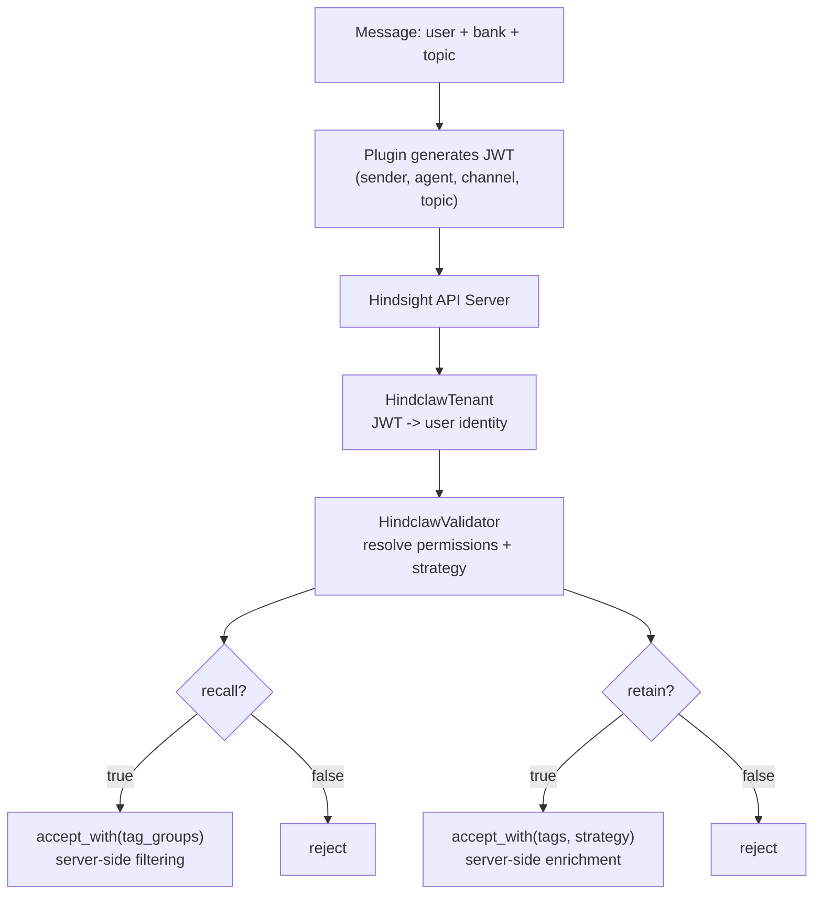

# What is hindclaw?

hindclaw is a production-grade [Hindsight](https://hindsight.vectorize.io) memory system for [OpenClaw](https://github.com/openclaw/openclaw). It consists of two components: a **thin plugin** that generates JWTs and sends standard Hindsight API calls, and a **server extension** (`hindclaw-extension`) that enforces access control, resolves permissions, and enriches requests with tags and strategies. Together they give your AI agent fleet long-term memory with per-agent configuration, multi-bank recall, named retain strategies, and infrastructure-as-code management.

## Two Dimensions

Every message resolves along two orthogonal axes:

**WHO** -- permissions enforced server-side by the hindclaw-extension. Users, groups, and bank-level overrides are managed via the `/ext/hindclaw/*` REST API (not config files). Resolution follows 4 layers (global group defaults -> bank `_default` baseline -> bank group overlay -> bank user override) with 11 configurable fields at every layer: LLM model, token budget, extraction depth, tag visibility, retention frequency.

**HOW** -- strategy resolved per scope via a 5-level cascade (agent -> channel -> topic -> group -> user). Each scope routes to a named strategy with its own extraction mission, mode, and entity labels. Strategy resolution and tag enrichment happen server-side.

Permission resolution, tag injection, and strategy selection all happen server-side in the hindclaw-extension. The plugin is a thin adapter that generates a JWT and sends standard Hindsight API calls. Every combination of **(user x bank x topic)** can produce different behavior.

## Core Features

**Per-agent bank configs** -- each agent gets its own retain mission, entity labels, dispositions, and directives. Configured via JSON5 files, synced to Hindsight via `hindclaw apply`.

**Multi-bank recall** -- agents read from multiple banks in parallel. A strategic advisor recalls from finance, marketing, and ops banks simultaneously.

**Named retain strategies** -- map conversation topics to extraction profiles. Strategic conversations get deep analysis, daily chats get lightweight extraction. Strategies can also be assigned per user group.

**Access control** -- server-side via hindclaw-extension. Users belong to groups. Groups define defaults. Banks override per-group or per-user. Anonymous users blocked by default. Dual authentication: JWT for plugins acting on behalf of users, API keys for direct access (CLI, dashboards, personal tools). Users and groups are managed via the `/ext/hindclaw/*` REST API.

**Infrastructure as Code** -- `hindclaw plan/apply/import`. Declare bank configs in JSON5 files, diff against server state, apply changes. Like Terraform for memory banks.

**Session start context** -- mental models loaded before the first message. No cold start.

**Reflect-on-recall** -- use Hindsight's reflect API instead of raw recall for richer, reasoned responses.

**Multi-server** -- per-agent infrastructure routing. One gateway, multiple Hindsight servers (home, office, local daemon).

## Built on Hindsight

[Hindsight](https://hindsight.vectorize.io) is a biomimetic memory system for AI agents with semantic, BM25, graph, and temporal retrieval. hindclaw is a client that maps OpenClaw concepts (agents, channels, topics, users) onto Hindsight capabilities (banks, strategies, tags, tag_groups).

## Next Steps

- [Installation](./getting-started/installation) -- set up the plugin and (optionally) the server extension
- [Bank Configuration](./guides/bank-configs) -- configure your first agent's memory
- [Access Control](./guides/access-control) -- set up multi-user permissions via hindclaw-extension
- [Configuration Reference](./reference/configuration) -- plugin and JWT configuration
